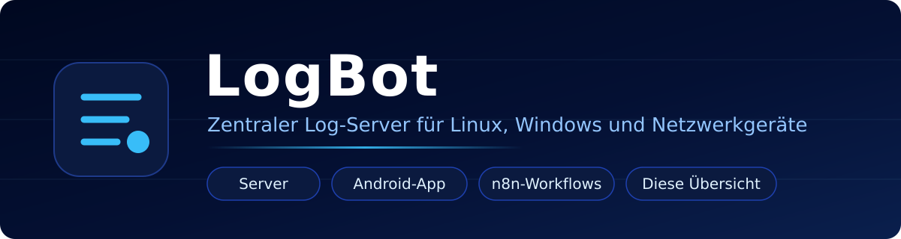
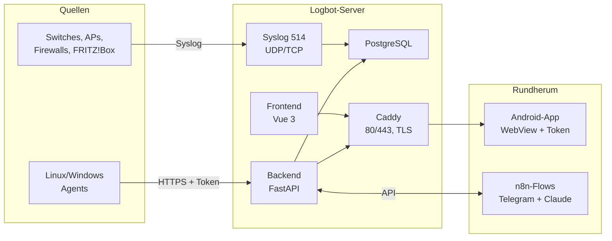

<div align="center">



# LogBot

**Ein Ort, an dem die Logs aller Systeme zusammenlaufen — und an dem man sie auch wiederfindet.**

Diese Repo ist die **Übersicht**: kein Code, sondern Landkarte, Erklärung und
Einstieg in alle Teile des Projekts.

[](https://github.com/Phydran6/Logbot-Server)
[](https://github.com/Phydran6/Logbot-Android-App)
[](https://github.com/Phydran6/Logbot-n8n-flow)
[](LICENSE)

[](https://github.com/Phydran6/Logbot-Server/releases)
[](https://github.com/Phydran6/Logbot-Server/commits/main)
[](https://github.com/Phydran6/Logbot-Android-App/commits/main)
[](https://github.com/Phydran6/Logbot-n8n-flow/commits/main)

</div>

---

## Wo will ich hin?

| Ich will … | Hier entlang |
|---|---|
| **sofort loslegen** | [Schnellstart](#schnellstart) · [Installation](https://github.com/Phydran6/Logbot-Server/blob/main/docs/install/README.md) |
| **verstehen, wie das Ganze zusammenhängt** | [Architektur](docs/architektur.md) |
| **wissen, welches Repo wofür da ist** | [Bausteine](#die-bausteine) · [Komponenten im Detail](docs/komponenten.md) |
| **direkt in eine bestimmte Datei springen** | [Wegweiser — alle Links](docs/wegweiser.md) |
| **selbst daran entwickeln** | [Entwickeln](docs/entwickeln.md) |
| **einen Fehler melden** | [Issues — aber im richtigen Repo](docs/wegweiser.md#issues-und-diskussionen) |

---

## Was LogBot ist

Server, Arbeitsplätze, Switches, Access Points, Firewalls, FRITZ!Box: Was Syslog
spricht oder einen Agent tragen kann, meldet hierher. Ein Docker-Stack, ein
Installationsbefehl, eine Oberfläche im Browser — dazu eine Android-App fürs
Handy und fertige n8n-Abläufe für alles, was automatisch passieren soll.

| | |
|---|---|
| **Logs annehmen** | Syslog auf UDP/TCP 514, Agents für Linux und Windows über HTTPS mit Token, Sammler wie n8n im Namen anderer Geräte |
| **Logs lesbar machen** | Parser für RFC 5424/3164, UniFi, Cisco IOS, Fortinet-`key=value`, JSON, Netfilter — Rohzeile bleibt daneben stehen |
| **Logs durchsuchen** | Filter nach Host, Zeit, Schweregrad, Kategorie, Facility, Geräteart — in der Adresse, im Export, als Lesezeichen |
| **Auswerten lassen** | Optional an Claude, ChatGPT oder einen n8n-Ablauf. Nichts davon ist voreingestellt |
| **Sich selbst verwalten** | Systemcheck, Patchmanagement, Sicherungen, Reverse Proxy, TLS, LDAP, MFA, Passkeys — alles im Browser |
| **Erweitert werden** | Portainer, Watchtower, n8n, Postfix — jeder einzeln zuschaltbar, keiner läuft ungefragt |

---

## Die Bausteine



<sub>Jeder Kasten ist mit seinem Verzeichnis verlinkt — dieselben Wege stehen unten als Tabelle.</sub>

| Repo | Was drin ist | Technik | Einstieg |
|---|---|---|---|
| 🖥️ **[Logbot-Server](https://github.com/Phydran6/Logbot-Server)** | Der Kern: Log-Annahme, Parser, Oberfläche, API, Verwaltung | Docker, FastAPI, Vue 3, PostgreSQL, Caddy | [README](https://github.com/Phydran6/Logbot-Server#readme) · [Installation](https://github.com/Phydran6/Logbot-Server/blob/main/docs/install/README.md) |
| 📱 **[Logbot-Android-App](https://github.com/Phydran6/Logbot-Android-App)** | Die eigene Instanz am Handy — gehärtete WebView, Token verschlüsselt, App-Lock per Biometrie | Kotlin, Android SDK 24+, Gradle | [README](https://github.com/Phydran6/Logbot-Android-App#readme) · [Changelog](https://github.com/Phydran6/Logbot-Android-App/blob/main/CHANGELOG.md) |
| 🔀 **[Logbot-n8n-flow](https://github.com/Phydran6/Logbot-n8n-flow)** | Fertiger Ablauf: Telegram fragt, Claude analysiert die Logs, Antwort geht zurück in den Chat | n8n, Anthropic API, Telegram Bot | [README](https://github.com/Phydran6/Logbot-n8n-flow#readme) · [Logbot.json](https://github.com/Phydran6/Logbot-n8n-flow/blob/main/Logbot.json) |
| 🧭 **[Logbot](https://github.com/Phydran6/Logbot)** *(hier)* | Übersicht, Architektur, Wegweiser — kein Code, keine Releases | Markdown | [Wegweiser](docs/wegweiser.md) |

→ Ausführlich je Baustein: **[docs/komponenten.md](docs/komponenten.md)**

---

## Schnellstart

**Server aufsetzen** — auf einem Linux-Host mit Root:

```bash
curl -sSL https://raw.githubusercontent.com/Phydran6/Logbot-Server/main/install.sh | sudo bash
```

Danach:

- **Oberfläche:** `http://SERVER-IP` — Anmeldung `admin` / `admin`
  *(sofort ändern; HTTPS danach unter Einstellungen → Netzwerk einschalten)*
- **API-Doku:** `http://SERVER-IP/api/docs`
- **Syslog:** Port 514 (UDP/TCP)

**Handy anbinden** — im Web-UI unter *App* den QR-Code erzeugen, in der
Android-App scannen. URL und Token landen verschlüsselt auf dem Gerät.

**Automatisieren** — [`Logbot.json`](https://github.com/Phydran6/Logbot-n8n-flow/blob/main/Logbot.json)
in n8n importieren, Zugangsdaten hinterlegen, Endpoint eintragen, aktivieren.

→ Alle Wege im Detail: [Architektur → Datenwege](docs/architektur.md#datenwege)

---

## Projektstand

| | |
|---|---|
| **Versionsschema** | `JAHR.MONAT.TAG.STUNDE.MINUTE.SEKUNDE` — in allen Repos gleich |
| **Server-Releases** | [Releases](https://github.com/Phydran6/Logbot-Server/releases) · [Release-Verlauf](https://github.com/Phydran6/Logbot-Server/blob/main/CHANGELOG/releases.md) |
| **App-Releases** | [Releases](https://github.com/Phydran6/Logbot-Android-App/releases) · [Changelog](https://github.com/Phydran6/Logbot-Android-App/blob/main/CHANGELOG.md) · [Debug-APK aus CI](https://github.com/Phydran6/Logbot-Android-App/actions/workflows/build-debug.yml) |
| **Diese Repo** | trägt keine Releases und keine Tags — sie zeigt nur auf die anderen |

---

## Mitmachen

Fehler und Wünsche gehören in das Repo, in dem der Code steht — nicht hierher.
Welches das ist, steht im [Wegweiser](docs/wegweiser.md#issues-und-diskussionen).
Was hier hineingehört: alles, was die *Übersicht* betrifft — falsche Links,
fehlende Erklärungen, veraltete Bilder.

Regeln fürs Entwickeln (Versionsstand, Changelog, Branches):
**[docs/entwickeln.md](docs/entwickeln.md)**

## Lizenz

[MIT](LICENSE) — wie alle Teile des Projekts.

<div align="center">
<sub>Entwickelt von <a href="https://github.com/Phydran6">Phydran6</a></sub>
</div>
