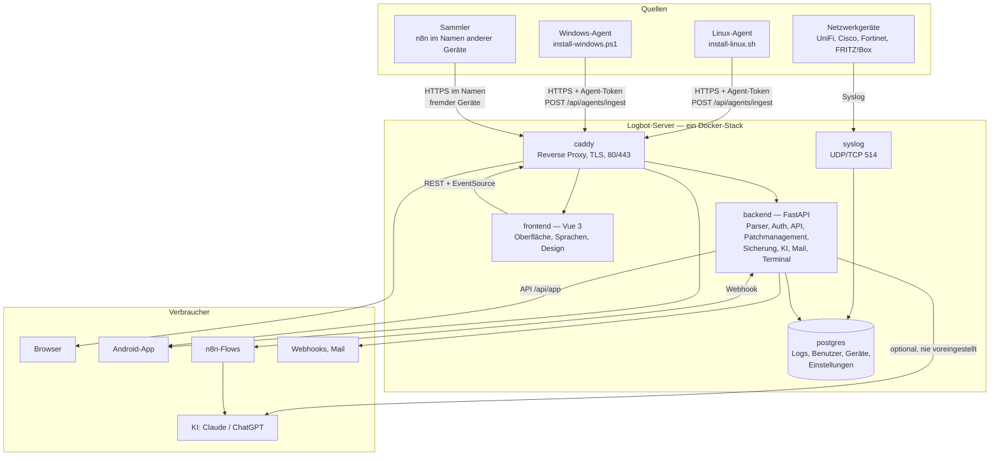
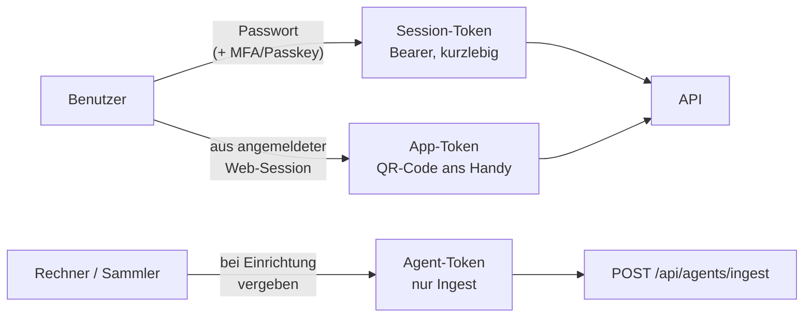
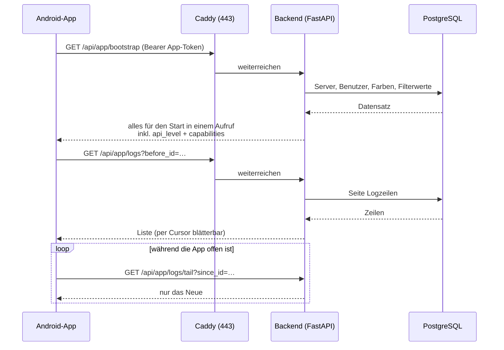
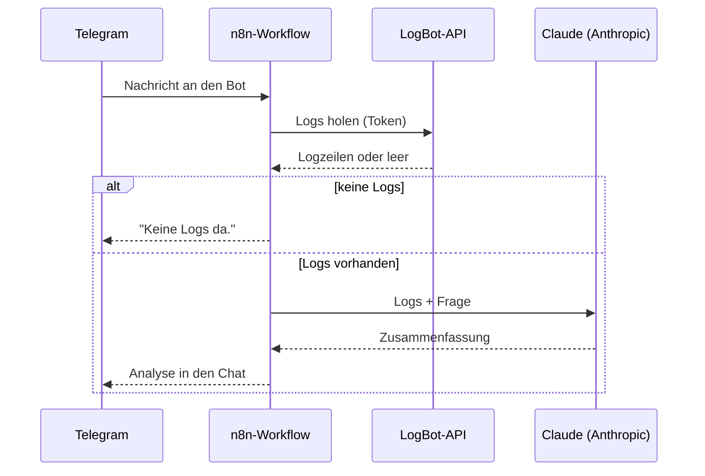

# Architektur

Wie die Teile zusammenspielen — von der Logzeile auf dem Switch bis zur Antwort
im Telegram-Chat.

← [Übersicht](../README.md) · [Komponenten](komponenten.md) · [Wegweiser](wegweiser.md)

---

## Das Gesamtbild



---

## Datenwege

Es gibt genau drei Wege, auf denen eine Logzeile in LogBot landet:

| Weg | Wer | Wie | Wohin |
|---|---|---|---|
| **Syslog** | Switches, APs, Firewalls, alles mit Syslog | UDP/TCP 514, RFC 5424 und 3164 | Dienst `syslog` → PostgreSQL |
| **Agent** | Linux- und Windows-Rechner, auch aus fremden Netzen | HTTPS, `Authorization: Bearer <AGENT-TOKEN>`, `POST /api/agents/ingest` | Backend → PostgreSQL |
| **Sammler** | n8n und Ähnliches, das für Geräte ohne eigenen Agent liefert (z. B. FRITZ!Box) | wie der Agent, nur mit fremdem `hostname`/`device_type` | Backend → PostgreSQL |

Und drei Wege wieder heraus:

| Weg | Wofür |
|---|---|
| **Browser** | Oberfläche, Filter in der Adresse, Export als CSV/JSON |
| **App** (`/api/app/*`) | schlanker Zweig für das Handy: `bootstrap`, `logs`, `logs/tail`, `summary`, `devices` |
| **Webhook / KI** | Auswertung durch Claude, ChatGPT oder einen n8n-Ablauf |

---

## Anmeldung und Token

Drei Sorten Zugang, die man nicht verwechseln sollte:



- **Session-Token** — aus `POST /api/auth/login`. Bei aktivem MFA in zwei
  Schritten über `POST /api/auth/login/mfa`.
- **App-Token** — entsteht nur aus einer bereits angemeldeten Web-Session und
  geht als QR-Code (`{"url": "...", "token": "..."}`) ans Handy. Die App legt
  ihn verschlüsselt ab (`EncryptedSharedPreferences`).
- **Agent-Token** — darf ausschließlich Logs abliefern.

Zwei Ausnahmen von der Kopfzeile: Ereignisstrom (`EventSource`) und Terminal
(`WebSocket`) tragen den Token als `?token=` — geprüft wird er genauso streng.

→ Einzelheiten: [API-Doku im Server-Repo](https://github.com/Phydran6/Logbot-Server/blob/main/docs/api/README.md)

---

## Der Weg einer Anfrage aus der App



`bootstrap` meldet `api_level` und `capabilities` — daran erkennt eine ältere
App, was der Server schon kann.

---

## Der Weg einer KI-Auswertung



Der Ablauf liegt zweimal: eigenständig in
[Logbot-n8n-flow](https://github.com/Phydran6/Logbot-n8n-flow) und mitgeliefert
unter [`Logbot-Server/n8n/`](https://github.com/Phydran6/Logbot-Server/tree/main/n8n).

Läuft n8n als Container neben LogBot, lautet die interne Adresse
`http://logbot-n8n:5678/webhook/logbot` — dann bleiben die Daten im Docker-Netz,
solange der Workflow sie nicht weitergibt.

---

## Dienste und Häfen

| Dienst | Image / Bau | Port | Bemerkung |
|---|---|---|---|
| `caddy` | `caddy:2-alpine` | **80**, **443** | einziger Weg von außen; TLS und DNS im Browser einstellbar |
| `syslog` | eigenes Dockerfile | **514/udp**, **514/tcp** | nimmt Rohzeilen an |
| `backend` | FastAPI | 8000 *(intern)* | API, Auth, Parser, Verwaltung |
| `frontend` | Vue 3 hinter nginx | 80 *(intern)* | ausgelieferte Oberfläche |
| `postgres` | `postgres:17-alpine` | 5432, gebunden an `127.0.0.1` | über `DB_BIND` steuerbar |

Zuschaltbar, nie voreingestellt: **Portainer**, **Watchtower**, **n8n**, **Postfix**.

Compose-Varianten liegen unter
[`deploy/`](https://github.com/Phydran6/Logbot-Server/tree/main/deploy):
externe Datenbank, gehärteter Betrieb, Zusatzdienste.

---

## Voraussetzungen

- Linux (Ubuntu 20.04+ oder vergleichbar), x86_64 oder ARM64
- Docker mit Compose-Plugin *(installiert der Installer bei Bedarf selbst)*
- Root-Zugriff
- 1 GB RAM und 4 GB Platte für LogBot allein — mehr je nach Zusatzdiensten
- Für die App: Android 7.0 (API 24) oder neuer

Ob die Maschine reicht, sagt die Systemprüfung:

```bash
sudo bash install/preflight.sh                 # nur LogBot
sudo bash install/preflight.sh portainer n8n   # mit Zusatzdiensten
```

---

## Weiter

- [Komponenten im Detail](komponenten.md)
- [Wegweiser — alle Links](wegweiser.md)
- [Entwickeln](entwickeln.md)
